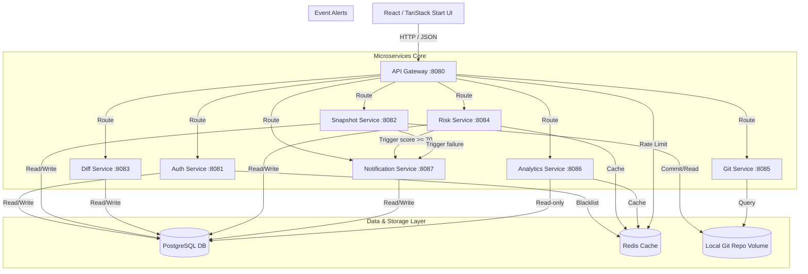

# MetaDiff — Enterprise DevOps Intelligence Platform

MetaDiff is a production-grade DevOps intelligence platform that ingests metadata snapshots, versions them using Git, performs deep structural comparisons, calculates deployment risk scores, tracks change history, and exposes all functionality through secure microservice REST APIs and a modern React dashboard.

---

## Architecture Diagram



---

## Technology Stack

- **Backend Framework**: Java 17, Spring Boot 3.3, Spring Cloud Gateway
- **Security**: Spring Security + Stateless JWT Authentication & Redis Blacklisting
- **Persistence**: Hibernate / JPA + PostgreSQL 16
- **Caching**: Redis 7
- **Version Control**: Eclipse JGit (Git Integration)
- **API Documentation**: OpenAPI 3 / Swagger
- **Deployment**: Multi-stage Dockerfiles + Docker Compose
- **Frontend**: React, TanStack Start (TypeScript), Vite, Tailwind CSS

---

## Directory Structure

```text
MetaDiff/
├── backend/
│   ├── pom.xml                  # Maven Parent POM
│   ├── shared-library/          # Shared JWT filters, custom exceptions and responses
│   ├── api-gateway/             # Spring Cloud Gateway + Rate Limiting + JWT Filter
│   ├── auth-service/            # Authentication, registrations, role checks
│   ├── snapshot-service/        # Metadata snapshot ingestion and JGit committing
│   ├── diff-service/            # Structural diff engine
│   ├── risk-service/            # Rule-based risk scoring and AI description
│   ├── git-service/             # Git commit log explorer
│   ├── analytics-service/       # Engineering throughput, hotspots & prediction
│   └── notification-service/    # Warning & failure alerting system
├── metadiff-insights/           # React TanStack Start Frontend UI
├── docker-compose.yml           # Runs the entire backend platform in Docker
└── .env.example                 # Template for PostgreSQL and JWT configuration
```

---

## Setup & Running Instructions

### 1. Prerequisites
- **Docker & Docker Compose** installed.
- **Java 17** & **Maven 3.9** (if running services locally).
- **Node.js** or **Bun** (for frontend development).

### 2. Environment Setup
Copy the template `.env.example` file to `.env` at the root and fill in the values:
```bash
POSTGRES_DB=metadiff
POSTGRES_USER=metadiff
POSTGRES_PASSWORD=changeme
JWT_SECRET=metadiff_super_secret_key_change_this_in_production_32chars
CORS_ALLOWED_ORIGINS=http://localhost:3000,http://localhost:5173
```

### 3. Running Backend Services (Docker Compose)
To start the entire database, Redis, Gateway, and 7 microservices:
```bash
docker compose up -d --build
```
Verify the services are healthy:
```bash
docker compose ps
```

### 4. Running the Frontend
Navigate to the frontend directory, install dependencies, and start the development server:
```bash
cd metadiff-insights
npm install
npm run dev
```
Open [http://localhost:3000](http://localhost:3000) (or the port output by Vite) in your browser.

---

## REST API Reference

All requests must pass through the **API Gateway** on port `8080`. Non-auth endpoints require a `Authorization: Bearer <JWT_ACCESS_TOKEN>` header.

### 1. Auth Service (`:8081` via Gateway)
- `POST /auth/register` — Create a new user with `name`, `email`, `role`, `password`.
- `POST /auth/login` — Sign in and receive `{ accessToken, refreshToken, user }`.
- `POST /auth/refresh` — Rotate access token.
- `POST /auth/logout` — Revoke and blacklist token.

### 2. Snapshot Service (`:8082` via Gateway)
- `POST /api/snapshots` — Upload a JSON/XML/ZIP metadata file (multipart form data). Returns snapshot metadata and triggers async processing and Git commit.
- `GET /api/snapshots` — List snapshots with optional search query.
- `GET /api/snapshots/{id}` — Get snapshot details.
- `GET /api/snapshots/{id}/tree` — Retrieve the structured JSON config tree.
- `DELETE /api/snapshots/{id}` — Delete a snapshot.

### 3. Diff Service (`:8083` via Gateway)
- `POST /api/diff` — Compare two snapshot IDs: `{ beforeSnapshotId, afterSnapshotId }`.
- `GET /api/diff/{id}` — Retrieve the diff report with change entries.
- `GET /api/diff/{id}/visualization` — Get component metrics for impact charts.

### 4. Risk Service (`:8084` via Gateway)
- `GET /api/risk/{diffId}` — Retrieve risk score and level (LOW, MEDIUM, HIGH, CRITICAL).
- `GET /api/risk/{diffId}/breakdown` — Breakdown of risk by category.
- `GET /api/risk/{diffId}/explanation` — Retrieve AI explanation of findings and suggested actions.

### 5. Git Service (`:8085` via Gateway)
- `GET /api/git/history` — Get versioning commit timeline.
- `GET /api/git/commits/{sha}` — Get commit details by SHA.
- `GET /api/git/compare?from={sha}&to={sha}` — High level Git compare stats.

### 6. Analytics Service (`:8086` via Gateway)
- `GET /api/analytics/metrics` — Dashboard KPI summaries.
- `GET /api/analytics/trends` — List values for risk and deploy graphs.
- `GET /api/analytics/hotspots` — Churn hotspots.
- `GET /api/analytics/prediction` — Moving-average model risk prediction for next deployment.

### 7. Notification Service (`:8087` via Gateway)
- `GET /api/notifications` — Retrieve alerts.
- `POST /api/notifications/{id}/read` — Dismiss an alert.
- `POST /api/notifications` — Create an alert (used internally).
